# Nick's Practice Log

 

[View the live site here](https://nicks-practice-log.herokuapp.com/)
 
 

# Table of Contents
1. [Introduction](#introduction)
    i. [Aims](#aims)
2. [User Experience](#user-experience-ux)
3. [Main Features](#main-features)
    1. [Inspiration & Design](#inspiration--design)
    4. [Flow Chart](#)
    5. [Features](#features)
    7. [Future Developments](#future-developments)
4. [Technologies](#technologies)
5. [Testing](#testing)
    1. [Manual Testing](#manual-testing)
    2. [Code Validation](#code-validation)
    4. [Tools](#tools)
6. [Deployment](#deployment)
    1. [GitHub](#github)
    2. [Forking](#forking)
    3. [Cloning](#cloning)
7. [References & Acknowledgements](#references--acknowledgements)
   3. [References](#references)
   4. [Acknoledgements](#acknoledgements)
 
 

# Introduction & Aims
This project acts as a proof of concept in developing a program to assist musicians with keeping track of their practice routines. 

As a musician myself, I understand well that practice is a incredibly important part of maintaining and developing musical skill. As such I planned to see if an interactive chat-based logging model could work for storing data relating to practice activities that could be refered to for later insight, therby informing future practice efficacy.

This project is intended for use by a single user, but can, and likely will be developed for exclusive multi-user functionality in its next development.
 
 

## Aims
- Design and build an interactive practice logging system using an API to save data to a spreadsheet.
- The project should exclusively use the [Python](https://en.wikipedia.org/wiki/Python_(programming_language)) language, run in a CLI and be deployed via [Heroku](https://signup.heroku.com/)
- Provide a system for saving basic practice data such as date, duration, exercises, and challenges
- Be able to pull data from the spreadsheet source for insights into current practice material
- Provide a system for storing inputted data using an API
- Have reliable error-handling 
- Include a singular sense of personality for a better UX
- Give clear instructions on functions and features
 
 

## User Stories
As a single returning user for this program I want to be able to:
- Easily understand how to navigate the program
- Log basic practice session data
- View basic practice session data
- View a statistic on my practice data such as average time spent practicing
- View a lists of exercises and be able to add my own ideas to those lists
- Be offered a random selection of exercises from my lists to inspire my next practice session
- Be able to gracefully quit the program when finished
 
 

# Main Features
## Wireframes
Wireframes have been omitted in this readme due to the simplistic nature of the deployment. The browser window remains static and the only changes occur within the console window.
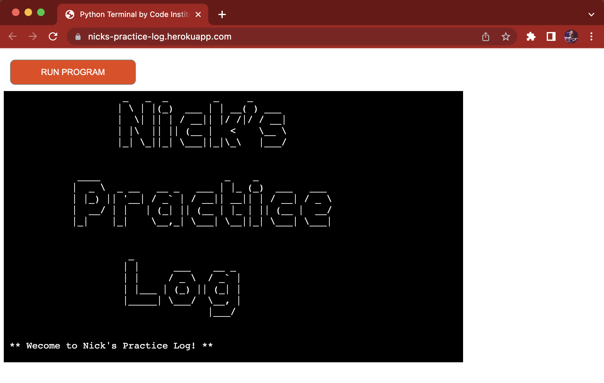
 
 

## Logic Flowchart
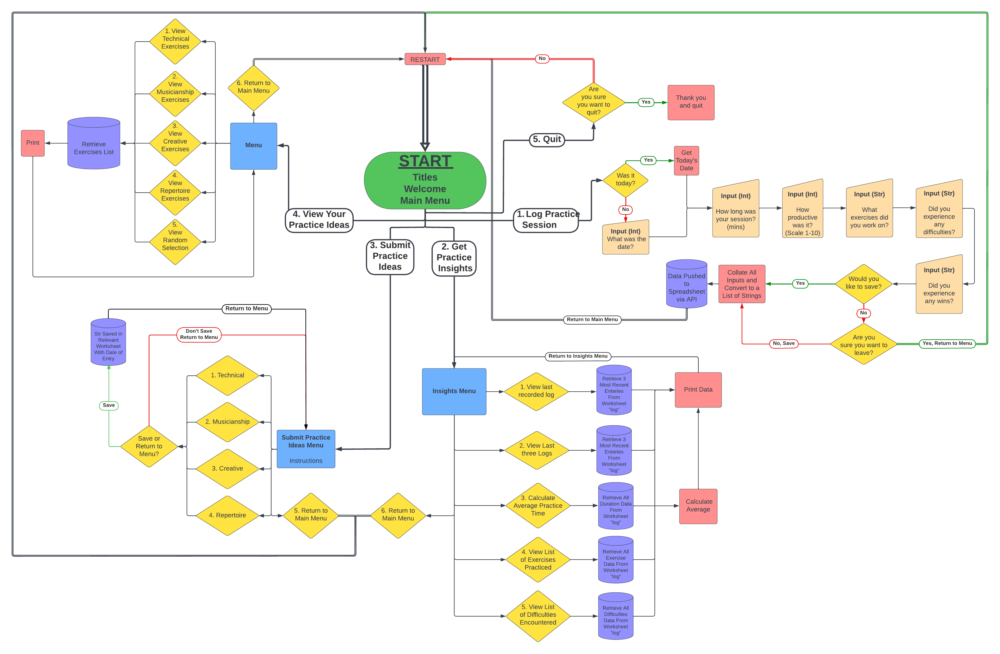
 

This flowcart was created using [Lucid Chart](https://www.lucidchart.com/). This flowchart details the main logic of the program, excluding input validation loops for the sake of simplicity and ease of interpretation.
 
 

### Start & Main Menu
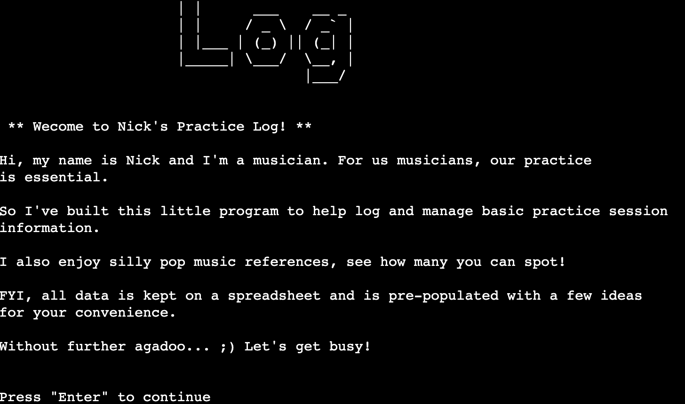
The main menu introduces the user to the program and provides brief contextual information.
 
 

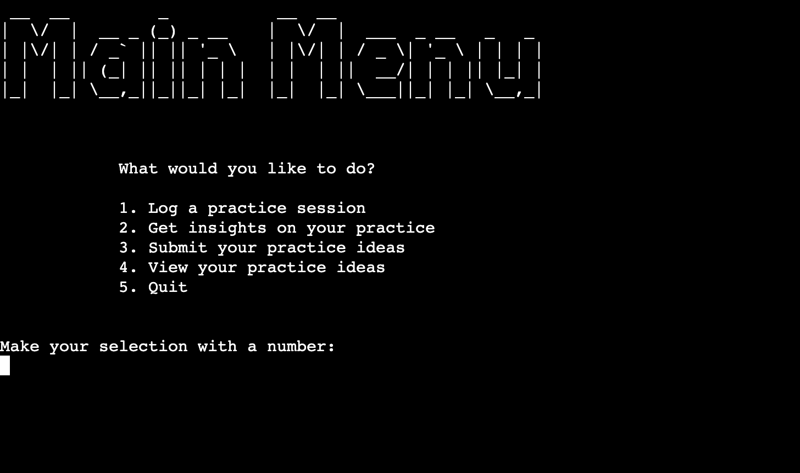
 
The Main Menu provides the main selection of options which the program can currently handle.
 
 

### 1. Log Practice
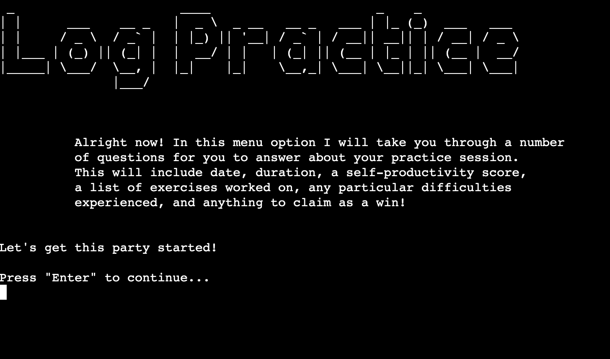
 
Option 1 - Log Practice, takes the user step-by-step through the process of gaining data on the practice date, duration, productivity score, list of exercises undertaken, expression of difficulties for later practice, and successes from the session. 
 
 

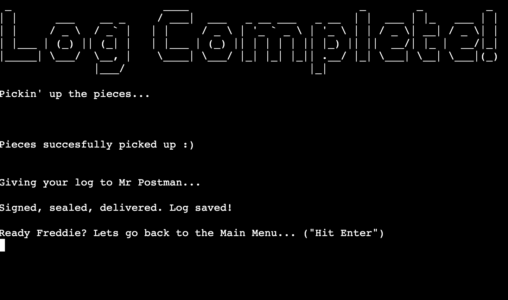
 
Once complete, the program will play back all of the information and give the user the option to save. Saving utilises the API and sends the data to the spreadsheet
 
 
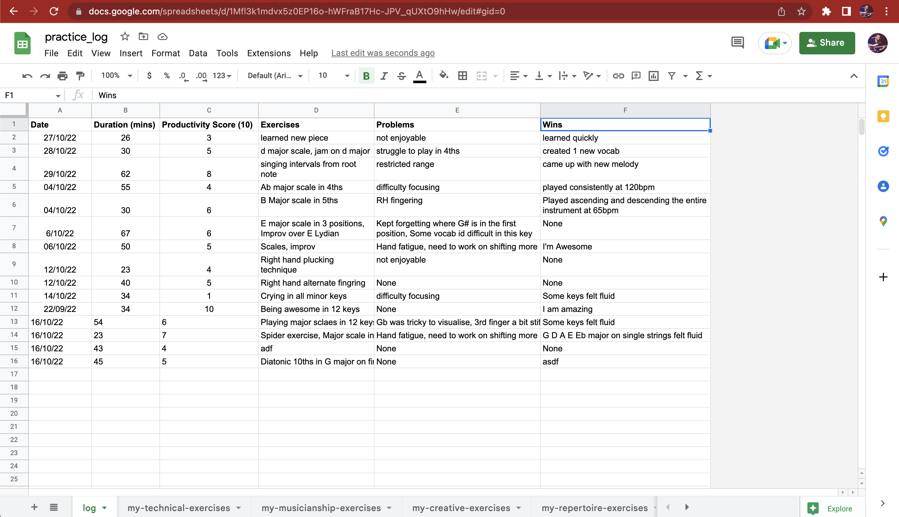
 
Each new log enters a new row of data at the bottom of this spreadsheet

### 2. Get Insights
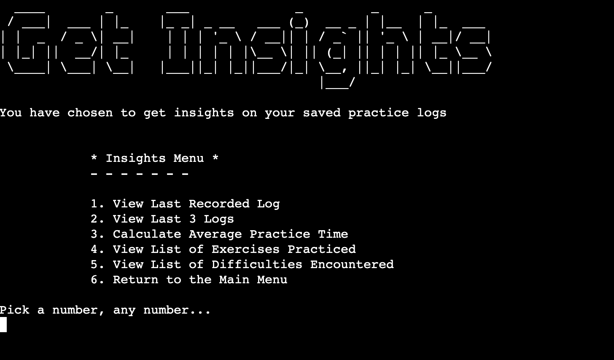
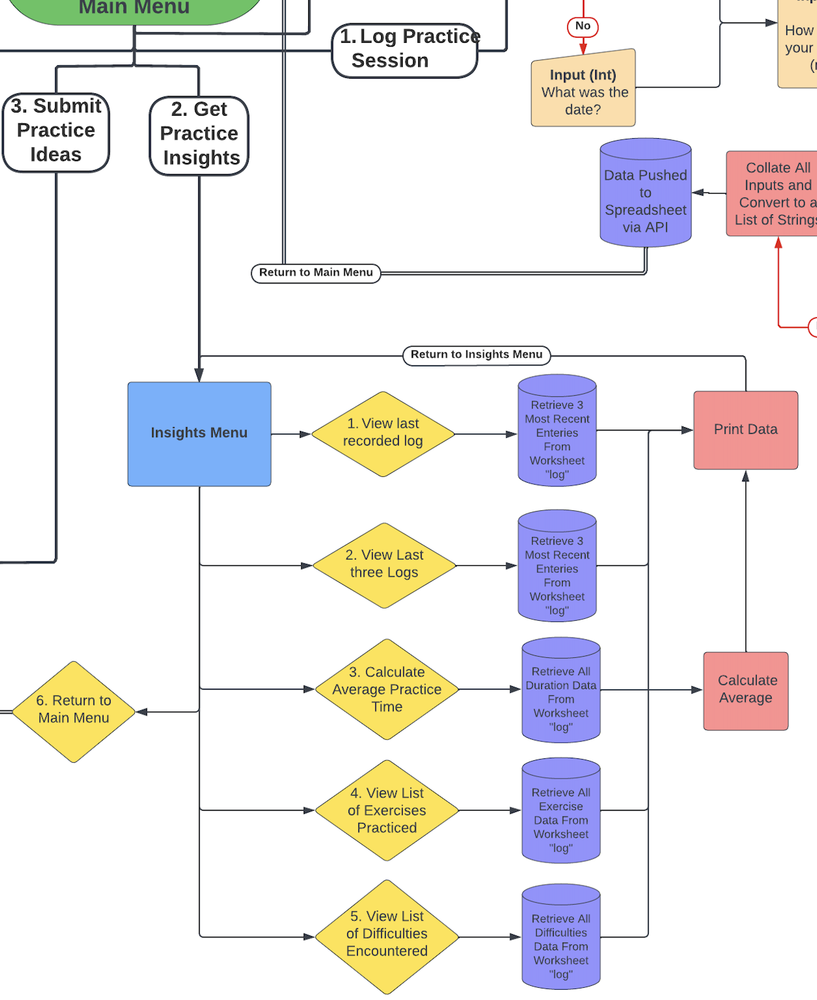
 
Option 2 - Get Insights allows the user to view the last inputted log, view the last three logs, calculate the average time spent practicing, view the complete list of exercises, and view the complete list of difficulties. All this information can assist the user in determining the best course of action for their next practice session.

### 3. Submit Practice Ideas
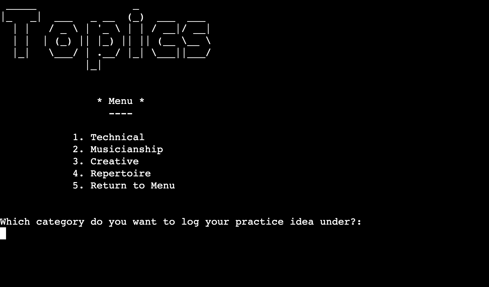
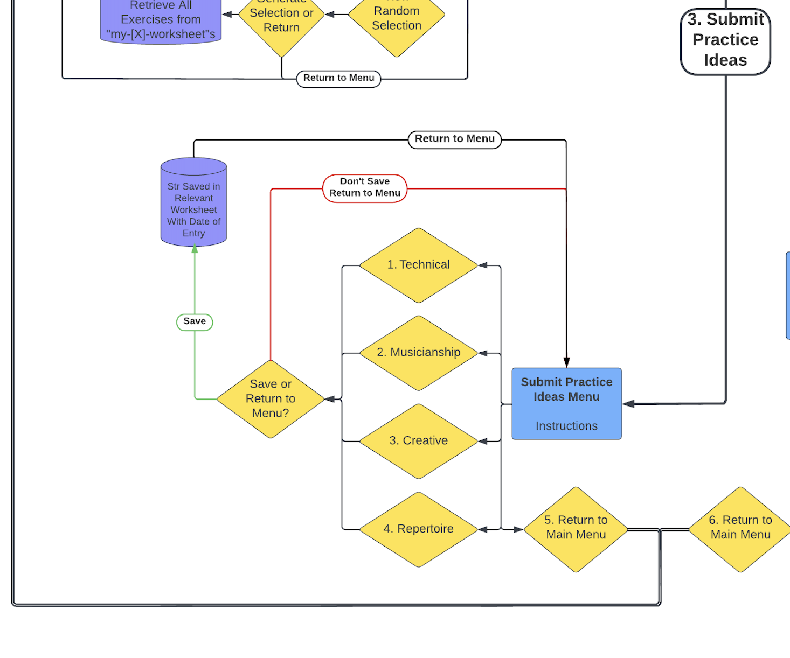
 
Option 3 - Submit Practice Ideas. The user can submit their own practice exercise to the program under one of four general topic headings. Each topic heading relates to a seperate worksheet in the main spreadsheet. 
 
 

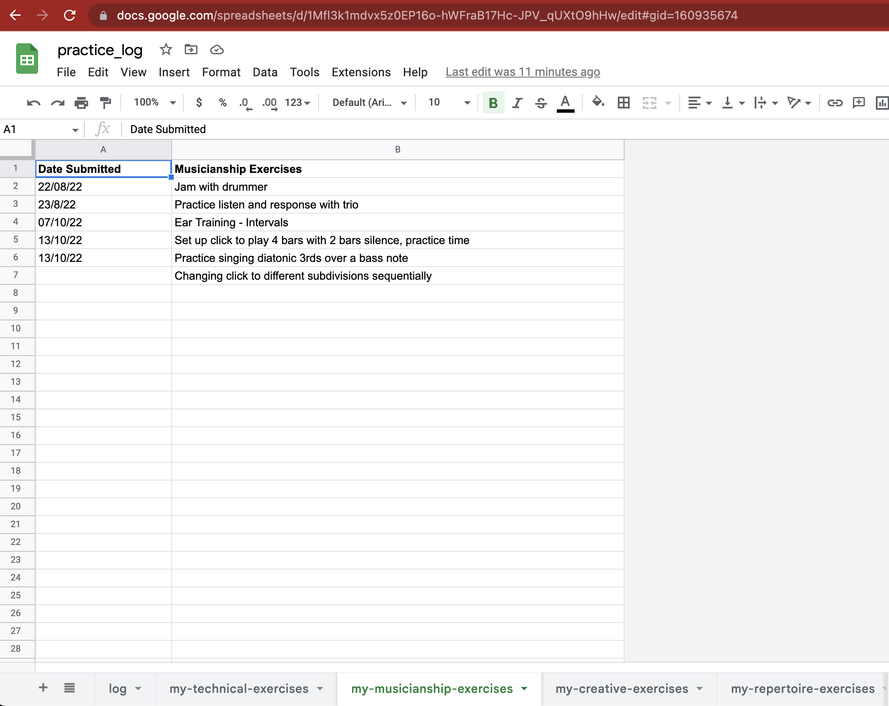
 
The four main topics of practice are: Technique, Musicianship, Creative, and Repertoire. These topics are briefly explained to the user before the menu choice is available.

### 4. View Practice
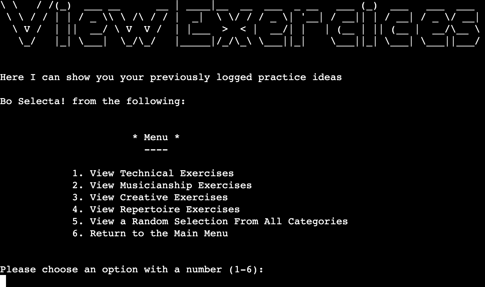
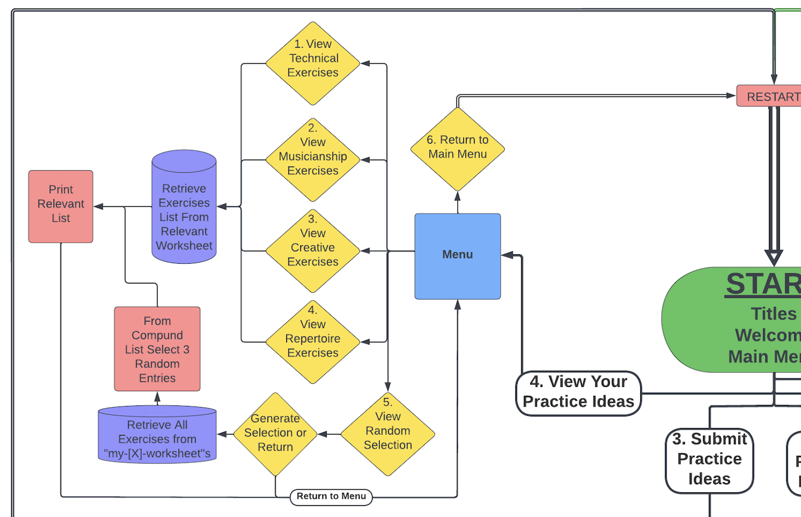
 
Option 4 - View Exercises. This part of the program acts as a get-all, it will list all of the available data from the relevant worksheet that has been requested by the user. Here they can view all exercises in the spreadsheet from a particular topic. 

### 4. Practice Idea Generator

 
Within the menu for option 4 is a random exercise generator. Here the user can indefinitely generate a random selectin of three exercises for use as inspiration in a practice session. All exercise data is collated from each of the four topics worksheets which is previously possible for the user to submit to. From this data a random selection of three is chosen and presented to the user.

### 5. Quit

 
Option 5 - Quit. The final option is for the user to gracefully exit the program and offers an 'Are you sure?' safety option in case of accidental selection. On quitting the program delivers a goodbye message.

## Future Developments
This project has a great deal of developmental potential in features that could eventually add increased functionality and a deeper user experiece. 

The following are a few examples:
- View logs within a range of productivity certain scores and the data associated with them
- After viewing lists of exercises, immediatly have the option to add more
- A search for an individual log function, by date, or by exercise
- Any one piece of data from any method the user can locate the whole log associated with it
- Set parameters for the generator to accept or decline certain variables, topics, or exercises
- Gain more detailed data on a practice session log such as, time of day, time spent of each exercise, additional user notes, place of practice, links or references to resources
- Exercises have links to required resources 
- Multi-user funcitonality. User can load individual practice log data, the program adapts and utilises users name and details for a personalised experience

 
 

# Technologies
Languages used in this site are [Python](https://en.wikipedia.org/wiki/Python_(programming_language))

Additional technologies include: 
- [GitHub](https://github.com/)
  - Site repository
- [Gitpod](https://gitpod.io/)
  - Online IDE for all coding work and site file management, terminal was used to add, commit, and push to Github
 
 

# 3rd party Modules
art

# Testing
## Pep8
This program is free of any Pep8 errors. There are however a number of suggestions and warnings against my use of global variables and their naming style. My global variables do not act as constants which the Pep8 validator believes they are. This project represents a learning curve for me with Python and its good practice conventions, I believe the use of global variables was a logical step within the scope of this project and in my learning the language. I understood too late to the deadline of this project that this isn't considered 'good practice'. Therefore, for future developments I will adapt this program to take this into account.
 
 

## Manual Testing 
Each function and validation has been manually tested. All testing logs can her viewed here:
[>> Testing](testing.md)
 
 

## Tools
Tools used in the development of this project include:
- [GitHub](https://github.com/)
- [GitPod](https://gitpod.io/)
- [Heroku](https://heroku.com/)
- [Python Tutor](https://pythontutor.com/visualize.html#mode=edit)
- [Lucid Chart](https://www.lucidchart.com/)
- [Google Drive](https://www.google.co.uk/intl/en-GB/drive/)
- [Google Sheets](https://www.google.co.uk/sheets/about/)
 
 

# Deployment
The live site can be accessed [here](https://nicks-practice-log.herokuapp.com/)
 
 

## Heroku
This project was deloyed to [Heroku](https://heroku.com/) with the following steps:
1. Log in to Heroku (create an account if necessary)
2. Navigate to your dashboard, click "New" and select "Create new app"
3. Input an appropriate name for your project and choose a region
4. Click the "Settings" tab
5. Click "Reveal Config Vars"
6. Input PORT and 8000 as one config var and click add
7. Input CREDS and the information from your Google Sheet API creds file as another config var and click add
8. Click "Add buildpack"
9. Add "nodejs" and "python" from the list or search if required, click save.
10. Ensure python is the first build pack. YOu can drag to change the order
11. Select "Deploy" from the heading tabs
12. Select "GitHub - Connect to GitHub" next to the Deployment Methods
13. Click "Connect to GitHub"
14. Search for the repository ("practice-log") and click to connect
15. Click either 'Enable Automatic Deploys' or 'Deploy Branch' to deploy manually. If you select Deploy Branch please note you will need to manually deploy each time you update the repository.
16. Finally, click 'View' to visit the deployed site. It may take a moment to become visible
 
 

## Forking
To fork this repository on [Github](https://github.com/NickWaldock/practice-log) proceed with the following steps:
1. Log it to GitHub (create an account if necessary)
2. Locate the [GitHub Respository](https://github.com/NickWaldock/practice-log)
3. On the repository page, find the 'Fork' menu in the top right, click on the small down arrow
4. Select '+ Create a new fork'
5. Remane repository as required
6. Click 'Create Fork'
7. You now have your forked version of this repository
 
 

## Cloning
To clone the repository procees with the following steps:
1. Log in to GitHub (create an account if necessary)
2. Locate the [GitHub Respository](https://github.com/NickWaldock/practice-log)
3. On the repository page, find and click on the 'Code' menu in the mid-top right of the page
4. Choose to either download or open in GitHub Desktop,
  - or;
    5. Choose the HTTPS option and copy the URL to your clipboard
    6. - To clone the repository using HTTPS, under "HTTPS", copy the url
       - To clone the repository using an SSH key, including a certificate issued by your organization's SSH certificate authority, click SSH, then copy the url
       - To clone a repository using GitHub CLI, click GitHub CLI, then copy url
    7. Open Terminal and change the current directory to where you want the cloned directory
    8. Type git clone, and paste the url, press Enter to create your local clone
 
 

# References & Acknoledgements
- Unless specified, all code written in the run.py file is my own
- Gitpod repository template provided by [Code Institute](https://codeinstitute.net)

## References

The following sites were used for syntax checking, problem solving, and general coding concept referencing:
- 

 
 

## Acknoledgements
I am incredibly grateful to my Code Institute Mentor Chris Quinn for his support and guidance, as well as the course providers and tutors at Code Institute for the expertise and support.

Connect with me on [LinkedIn](https://www.linkedin.com/in/nicholas-waldock-05237071/)

References
General
https://www.programiz.com/python-programming/methods/string/lower
https://railsware.com/blog/python-for-machine-learning-indexing-and-slicing-for-lists-tuples-strings-and-other-sequential-types/
https://www.edureka.co/blog/python-list-length/
https://docs.gspread.org/en/latest/user-guide.html

Clear screen
https://www.geeksforgeeks.org/clear-screen-python/

Datetime formatting
https://pynative.com/python-datetime-format-strftime/

Checking string format
https://www.adamsmith.haus/python/answers/how-to-check-if-a-string-matches-a-pattern-in-python

Checking for integer
https://bobbyhadz.com/blog/python-check-if-input-is-integer#:~:text=isdigit()%20%23-,Use%20the%20str.,point%20numbers%20or%20negative%20numbers.
https://pythonguides.com/python-check-if-the-variable-is-an-integer/

Code checker
https://www.pythonchecker.com/

The slow print
https://replit.com/talk/learn/The-Slow-Print/44741

pretty printer
https://docs.python.org/3/library/pprint.html

Console Art
https://github.com/sepandhaghighi/art

https://kodify.net/python/math/round-integers/

Random
https://pynative.com/python-random-choice/

Conditionals
https://www.openbookproject.net/books/bpp4awd/ch04.html

Strip
https://www.w3schools.com/python/ref_string_strip.asp

BUGS
Data not pushing to spreadsheet - due to attemping to send dictionary objects across. Topics dicts function removed and replaced with a log_exercises function