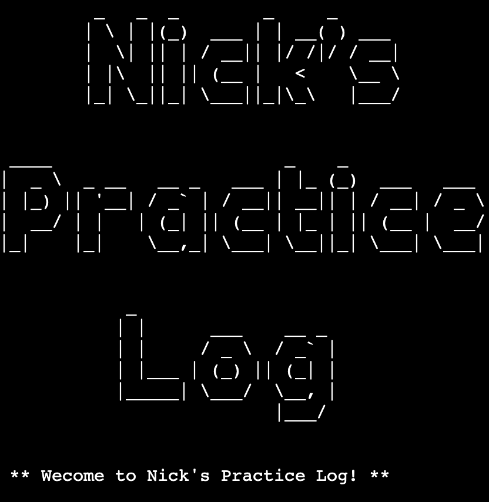

# Nick's Practice Log

 

[View the live site here](https://nicks-practice-log.herokuapp.com/)
 
 

# Table of Contents
1. [Introduction](#introduction)
    i. [Aims](#aims)
2. [User Experience](#user-experience-ux)
3. [Main Features](#main-features)
    1. [Inspiration & Design](#inspiration--design)
    4. [Flow Chart](#)
    5. [Features](#features)
    7. [Future Developments](#future-developments)
4. [Technologies](#technologies)
5. [Testing](#testing)
    1. [Manual Testing](#manual-testing)
    2. [Code Validation](#code-validation)
    4. [Tools](#tools)
6. [Deployment](#deployment)
    1. [GitHub](#github)
    2. [Forking](#forking)
    3. [Cloning](#cloning)
7. [References & Acknowledgements](#references--acknowledgements)
   3. [References](#references)
   4. [Acknoledgements](#acknoledgements)
 
 

# Introduction & Aims

 
 

## Aims
- 
 
 

# Main Features
## Inspiration & Design

 
 

## Wireframes
[Balsamiq](https://balsamiq.cloud/) has been used to develop wireframes to demonstrate the basic design of the site.
 
 

 
 

## Features

 
 

## User Interactivity
 
 

 
 

## Future Developments
This project has a great deal of developmental potential in features that could eventually add increased functionality and a deeper user experiece. 
The following are a few examples:
-  
 
 

# Technologies
Languages used in this site are [Python]

Additional technologies include: 

- [GitHub](https://github.com/)
  - Site repository
- [Gitpod](https://gitpod.io/)
  - Online IDE for all coding work and site file management, terminal was used to add, commit, and push to Github
 
 

# Testing
## Manual Testing 

**Design Expectation**
- 
**Testing**

**Result** * 
 
 

## Code Validation
Pep8

## Tools
[GitPod]
 
 

# Deployment
The live site can be accessed [here](https://nickwaldock.github.io/Awesome-80s/)
 
 

## GitHub
This project was deloyed to GitHub Pages with the following steps:
1. Log in to GitHub (create an account if necessary)
2. Locate the [GitHub Respository](https://github.com/NickWaldock/Awesome-80s)
3. On the repository page, find the 'Settings' icon anc click on it
4. In the Settings page, look for and click the 'Pages' menu item on the left hand side (under section titled 'Code and automation', you may need to scroll down slightly)
5. In the 'Pages' page, under 'Source', select 'Branch:main', then '/root' and click save
6. After a few minutes, the site will be published
 
 

## Forking
The fork this repository proceed with the following steps:
1. Log it to GitHub (create an account if necessary)
2. Locate the [GitHub Respository](https://github.com/NickWaldock/Awesome-80s)
3. On the repository page, find the 'Fork' menu in the top right, click on the small down arrow
4. Select '+ Create a new fork'
5. Remane repository as required
6. Click 'Create Fork'
7. You now have your forked version of this repository
 
 

## Cloning
To clone the repository procees with the following steps:
1. Log in to GitHub (create an account if necessary)
2. Locate the [GitHub Respository](https://github.com/NickWaldock/Awesome-80s)
3. On the repository page, find and click on the 'Code' menu in the mid-top right of the page
4. Choose to either download or open in GitHub Desktop,
  - or;
    5. Choose the HTTPS option and copy the URL to your clipboard
    6. - To clone the repository using HTTPS, under "HTTPS", copy the url
       - To clone the repository using an SSH key, including a certificate issued by your organization's SSH certificate authority, click SSH, then copy the url
       - To clone a repository using GitHub CLI, click GitHub CLI, then copy url
    7. Open Terminal and change the current directory to where you want the cloned directory
    8. Type git clone, and paste the url, press Enter to create your local clone
 
 

# References & Acknoledgements

## References

The following sites were used for syntax checking, problem solving, and general coding concept referencing:
- 

 
 

## Acknoledgements

References
General
https://www.programiz.com/python-programming/methods/string/lower
https://railsware.com/blog/python-for-machine-learning-indexing-and-slicing-for-lists-tuples-strings-and-other-sequential-types/
https://www.edureka.co/blog/python-list-length/
https://docs.gspread.org/en/latest/user-guide.html

Clear screen
https://www.geeksforgeeks.org/clear-screen-python/

Datetime formatting
https://pynative.com/python-datetime-format-strftime/

Checking string format
https://www.adamsmith.haus/python/answers/how-to-check-if-a-string-matches-a-pattern-in-python

Checking for integer
https://bobbyhadz.com/blog/python-check-if-input-is-integer#:~:text=isdigit()%20%23-,Use%20the%20str.,point%20numbers%20or%20negative%20numbers.
https://pythonguides.com/python-check-if-the-variable-is-an-integer/

Code checker
https://www.pythonchecker.com/

The slow print
https://replit.com/talk/learn/The-Slow-Print/44741

pretty printer
https://docs.python.org/3/library/pprint.html

Console Art
https://github.com/sepandhaghighi/art

https://kodify.net/python/math/round-integers/

Random
https://pynative.com/python-random-choice/

BUGS
Data not pushing to spreadsheet - due to attemping to send dictionary objects across. Topics dicts function removed and replaced with a log_exercises function