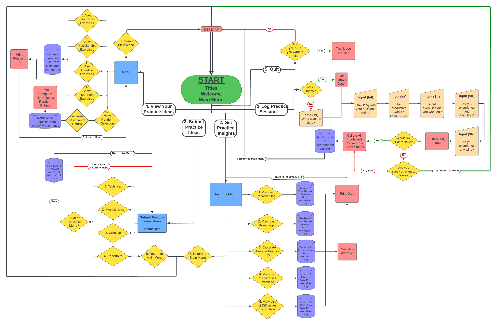
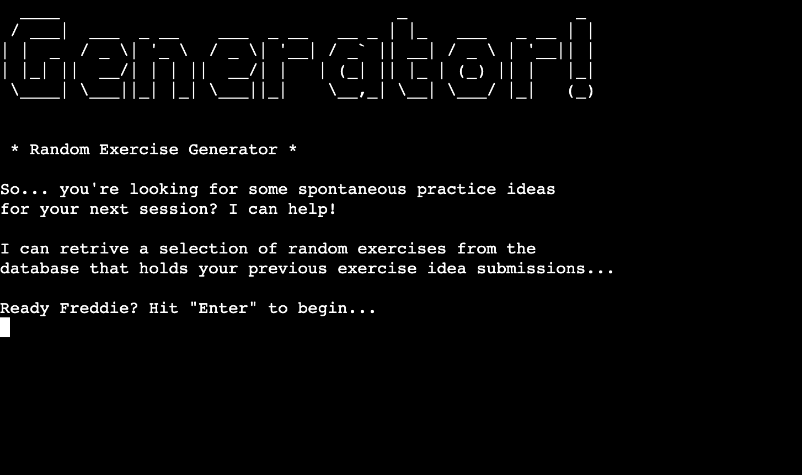
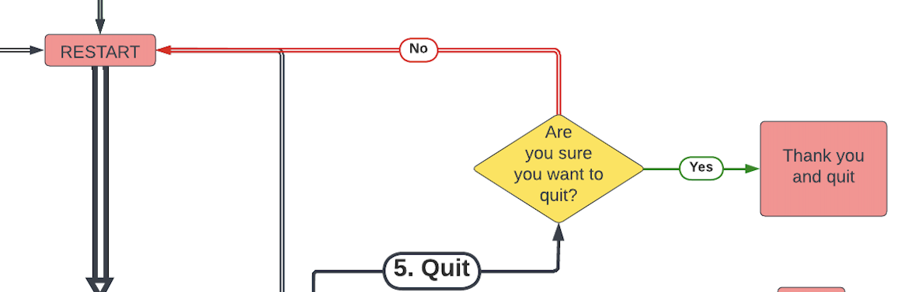
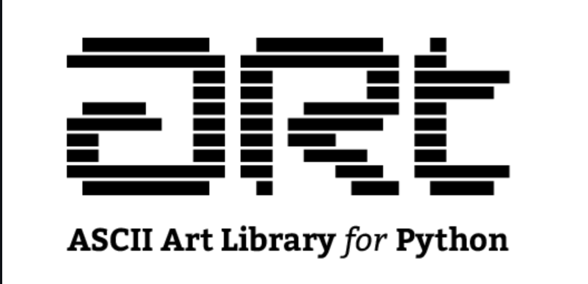

# Nick's Practice Log

 

[View the live site here](https://nicks-practice-log.herokuapp.com/)
 
 

# Table of Contents
1. [Introduction](#introduction)
    1. [Aims](#aims)
    2. [User Stories](#user-stories)
2. [Main Features](#main-features)
    1. [Wireframes](#wireframes)
    2. [Logic Flowchart](#logic-flowchart)
    3. [Start & Main Menu](#start--main-menu)
    4. [Log Practice](#1-log-practice)
    5. [Get Insights](#2-get-insights)
    6. [Submit Practice](#3-submit-practice-ideas)
    7. [View Practice](#4-view-practice)
    8. [Practice Generator](#4-practice-idea-generator)
    9. [Quit](#5-quit)
3. [Future Development](#future-developments)
4. [Technologies](#technologies)
    1. [Python Modules](#python-modules)
5. [Testing](#testing)
    1. [Pep8](#pep8)
    2. [Manual Testing](#manual-testing)
    3. [Tools](#tools)
6. [Deployment](#deployment)
    1. [Heroku](#heroku)
    2. [Forking](#forking)
    3. [Cloning](#cloning)
7. [References & Acknowledgements](#references--acknowledgements)
   1. [References](#references)
   2. [General Reference](#general-reference)
   3. [Code Reference](#code-reference)
   4. [Code Syntax Validators](#code-syntax-validators)
   5. [Acknoledgements](#acknoledgements)
 
 

# Introduction
This project acts as a proof of concept in developing a program to assist musicians with keeping track of their practice routines. 

As a musician myself, I understand well that practice is a incredibly important part of maintaining and developing musical skill. As such I planned to see if an interactive chat-based logging model could work for storing data relating to practice activities that could be refered to for later insight, therby informing future practice efficacy.

This project is intended for use by a single user, but can, and likely will be developed for exclusive multi-user functionality in its next development. Being intended for a single user (myself) I took the liberty to add numerous popular music references within the 'chat' personality as a way of making the process more engaging and entertaining.
 
 

## Aims
- Design and build an interactive practice logging system using an API to save data to a spreadsheet.
- The project should exclusively use the [Python](https://en.wikipedia.org/wiki/Python_(programming_language)) language, run in a CLI and be deployed via [Heroku](https://signup.heroku.com/)
- Provide a system for saving basic practice data such as date, duration, exercises, and challenges
- Be able to pull data from the spreadsheet source for insights into current practice material
- Provide a system for storing inputted data using an API
- Have reliable error-handling 
- Include a singular sense of personality for a better UX
- Give clear instructions on functions and features
 
 

## User Stories
As a single returning user for this program I want to be able to:
- Easily understand how to navigate the program
- Log basic practice session data
- View basic practice session data
- View a statistic on my practice data such as average time spent practicing
- View a lists of exercises and be able to add my own ideas to those lists
- Be offered a random selection of exercises from my lists to inspire my next practice session
- Be able to gracefully quit the program when finished
 
 

# Main Features
## Wireframes
Wireframes have been omitted in this readme due to the simplistic nature of the deployment. The browser window remains static and the only changes occur within the console window.

 
 

## Logic Flowchart

 

This flowcart was created using [Lucid Chart](https://www.lucidchart.com/). This flowchart details the main logic of the program, excluding input validation loops for the sake of simplicity and ease of interpretation.
 
 

## Start & Main Menu

 

On starting the program the user is presented with brief contextual information on the use and aims of the program.

 
 

 

The Main Menu provides the main selection of options which the program can currently handle.
 
 

## 1. Log Practice

 

Option 1 - Log Practice, takes the user step-by-step through the process of gaining data on the practice date, duration, productivity score, list of exercises undertaken, expression of difficulties for later practice, and successes from the session. 
 
 

 

Once complete, the program will play back all of the information and give the user the option to save. Saving utilises the API and sends the data to the spreadsheet
 
 

 
Each new log enters a new row of data at the bottom of this spreadsheet

## 2. Get Insights

 
Option 2 - Get Insights allows the user to view the last inputted log, view the last three logs, calculate the average time spent practicing, view the complete list of exercises, and view the complete list of difficulties. All this information can assist the user in determining the best course of action for their next practice session.

## 3. Submit Practice Ideas

 
Option 3 - Submit Practice Ideas. The user can submit their own practice exercise to the program under one of four general topic headings. Each topic heading relates to a seperate worksheet in the main spreadsheet. 
 
 

 
The four main topics of practice are: Technique, Musicianship, Creative, and Repertoire. These topics are briefly explained to the user before the menu choice is available.

## 4. View Practice

 
Option 4 - View Exercises. This part of the program acts as a get-all, it will list all of the available data from the relevant worksheet that has been requested by the user. Here they can view all exercises in the spreadsheet from a particular topic. 

## 4. Practice Idea Generator

 
Within the menu for option 4 is a random exercise generator. Here the user can indefinitely generate a random selectin of three exercises for use as inspiration in a practice session. All exercise data is collated from each of the four topics worksheets which is previously possible for the user to submit to. From this data a random selection of three is chosen and presented to the user.

## 5. Quit

 
Option 5 - Quit. The final option is for the user to gracefully exit the program and offers an 'Are you sure?' safety option in case of accidental selection. On quitting the program delivers a goodbye message.

# Future Developments
This project has a great deal of developmental potential in features that could eventually add increased functionality and a deeper user experiece. 

The following are a few examples:
- View logs within a range of productivity certain scores and the data associated with them
- After viewing lists of exercises, immediatly have the option to add more
- A search for an individual log function, by date, or by exercise
- Any one piece of data from any method the user can locate the whole log associated with it
- Set parameters for the generator to accept or decline certain variables, topics, or exercises
- Gain more detailed data on a practice session log such as, time of day, time spent of each exercise, additional user notes, place of practice, links or references to resources
- Exercises have links to required resources 
- Multi-user funcitonality. User can load individual practice log data, the program adapts and utilises users name and details for a personalised experience

 
 

# Technologies
Languages used in this site are [Python](https://en.wikipedia.org/wiki/Python_(programming_language))

Additional technologies include: 
- [GitHub](https://github.com/)
  - Site repository
- [Gitpod](https://gitpod.io/)
  - Online IDE for all coding work and site file management, terminal was used to add, commit, and push to Github
 
 

## Python Modules
Additional modules used in this python project include:
 

 

- [ASCII Art for Python](https://github.com/sepandhaghighi/art) 
- This 3rd party module was used and adapted into a general print function withint the project for ease when printing large titles. Only the standard font was used.
 

- [GSpread API](https://docs.gspread.org/en/latest/)
- The GSpread module was used as the API for interacting with the [Google Sheet](https://docs.google.com/spreadsheets/d/1Mfl3k1mdvx5z0EP16o-hWFraB17Hc-JPV_qUXtO9hHw/edit?usp=sharing).
 

- [Google Auth](https://developers.google.com/identity/protocols/oauth2)
- Google Auth was for generating the credentials for the API.
 
 

- Additional standard Python modules were also utilised such as: [datetime](https://docs.python.org/3/library/datetime.html), [re](https://docs.python.org/3/library/re.html), [random](https://docs.python.org/3/library/random.html?highlight=random%20module#module-random), [time](https://docs.python.org/3/library/time.html), and [os](https://docs.python.org/3/library/os.html).

 
 

# Testing
## Pep8
This program is free of any Pep8 errors. There are however a number of suggestions and warnings against my use of global variables and their naming style. My global variables do not act as constants which the Pep8 validator believes they are. This project represents a learning curve for me with Python and its good practice conventions, I believe the use of global variables was a logical step within the scope of this project and in my learning the language. I understood too late to the deadline of this project that this isn't considered 'good practice'. Therefore, for future developments I will adapt this program to take this into account.
 
 

## Manual Testing 
Each function and validation has been manually tested. All testing logs can her viewed here:
[>> Testing](testing.md)
 
 

## Tools
Tools used in the development of this project include:
- [GitHub](https://github.com/)
- [GitPod](https://gitpod.io/)
- [Heroku](https://heroku.com/)
- [Python Tutor](https://pythontutor.com/visualize.html#mode=edit)
- [Lucid Chart](https://www.lucidchart.com/)
- [Google Drive](https://www.google.co.uk/intl/en-GB/drive/)
- [Google Sheets](https://www.google.co.uk/sheets/about/)
 
 

# Deployment
The live site can be accessed [here](https://nicks-practice-log.herokuapp.com/)
 
 

## Heroku
This project was deloyed to [Heroku](https://heroku.com/) with the following steps:
1. Log in to Heroku (create an account if necessary)
2. Navigate to your dashboard, click "New" and select "Create new app"
3. Input an appropriate name for your project and choose a region
4. Click the "Settings" tab
5. Click "Reveal Config Vars"
6. Input PORT and 8000 as one config var and click add
7. Input CREDS and the information from your Google Sheet API creds file as another config var and click add
8. Click "Add buildpack"
9. Add "nodejs" and "python" from the list or search if required, click save.
10. Ensure python is the first build pack. YOu can drag to change the order
11. Select "Deploy" from the heading tabs
12. Select "GitHub - Connect to GitHub" next to the Deployment Methods
13. Click "Connect to GitHub"
14. Search for the repository ("practice-log") and click to connect
15. Click either 'Enable Automatic Deploys' or 'Deploy Branch' to deploy manually. If you select Deploy Branch please note you will need to manually deploy each time you update the repository.
16. Finally, click 'View' to visit the deployed site. It may take a moment to become visible
 
 

## Forking
To fork this repository on [Github](https://github.com/NickWaldock/practice-log) proceed with the following steps:
1. Log it to GitHub (create an account if necessary)
2. Locate the [GitHub Respository](https://github.com/NickWaldock/practice-log)
3. On the repository page, find the 'Fork' menu in the top right, click on the small down arrow
4. Select '+ Create a new fork'
5. Remane repository as required
6. Click 'Create Fork'
7. You now have your forked version of this repository
 
 

## Cloning
To clone the repository procees with the following steps:
1. Log in to GitHub (create an account if necessary)
2. Locate the [GitHub Respository](https://github.com/NickWaldock/practice-log)
3. On the repository page, find and click on the 'Code' menu in the mid-top right of the page
4. Choose to either download or open in GitHub Desktop,
  - or;
    5. Choose the HTTPS option and copy the URL to your clipboard
    6. - To clone the repository using HTTPS, under "HTTPS", copy the url
       - To clone the repository using an SSH key, including a certificate issued by your organization's SSH certificate authority, click SSH, then copy the url
       - To clone a repository using GitHub CLI, click GitHub CLI, then copy url
    7. Open Terminal and change the current directory to where you want the cloned directory
    8. Type git clone, and paste the url, press Enter to create your local clone
 
 

# References & Acknoledgements
- Unless specified, all code written in the run.py file is my own
- Gitpod repository template provided by [Code Institute](https://codeinstitute.net)
 
 

## General Reference
- [Python](https://www.python.org/)
General Reference
- [Programiz](https://www.programiz.com/python-programming/methods/string/lower)
Translating string inputs to lowercase, to assist with input validation.
- [Railsware](https://railsware.com/blogpython-for-machine-learning-indexing-and-slicing-for-lists-tuples-strings-and-other-sequential-types/
https://www.edureka.co/blog/python-list-length/)
Slicing for lists
- [GSpread](https://docs.gspread.org/en/latest/user-guide.html)
Use of the GSpread API
- [Open Book Project](https://www.openbookproject.net/books/bpp4awd/ch04.html)
Use of conditionals and general python reference
- [Kodify](https://kodify.net/python/math/round-integers/)
Using math to round integers
- [W3 Schools](https://www.w3schools.com/python/default.asp)
General python reference
- [Bobby Hadz](https://bobbyhadz.com/blog/python-check-if-input-is-integer#:~:text=isdigit()%20%23-,Use%20the%20str.,point%20numbers%20or%20negative%20numbers.)
Validating inputs for integers
- [Python Guides](https://pythonguides.com/python-check-if-the-variable-is-an-integer/)
Validating inputs for integers
 
 

## Code Reference
During the development of this project I occasionally needed to search for solutions to problems I was encountering. The following is a list of reference sites I relied upon to learn and understand Python concepts new to me. In some cases the article simply offered a simple use of method or concept, in more detailed and specific cases a Code Reference No. is assigned whcih corresponds to a comment in the main run.py file.

### Code Reference 1
[Geeks for Geeks](https://www.geeksforgeeks.org/clear-screen-python/)
run.py line 70 - Clear screen

### Code Reference 2

- [Adam Smith](https://www.adamsmith.haus/python/answers/how-to-check-if-a-string-matches-a-pattern-in-python)
run.py line 167 - used to validate the user has inputted the date in the correct format and with valid days, monthm and year digits.
 

### Code Reference 3
- [W3 Schools and Code Institute Tutor Ed](https://www.w3schools.com/python/ref_string_strip.asp)
run.py line 673 - Use for loop and strip to remove "," from strings within lists
 

### Code Reference 4

- [PY Native](https://pynative.com/python-random-choice/)
run.py line 1293 - Random selections
 
 

## Code Syntax Validators

The following sites were used for syntax and logic checking:
- [Python Tutor](https://pythontutor.com/visualize.html#mode=edit)
- [Python Code Checker](https://extendsclass.com/python-tester.html)
- [Python Syntax Checker](https://www.pythonchecker.com/)
 
 

## Acknoledgements
I am incredibly grateful to my Code Institute Mentor Chris Quinn for his support and guidance, as well as the course providers and tutors at Code Institute for the expertise and support.

Connect with me on [LinkedIn](https://www.linkedin.com/in/nicholas-waldock-05237071/)

